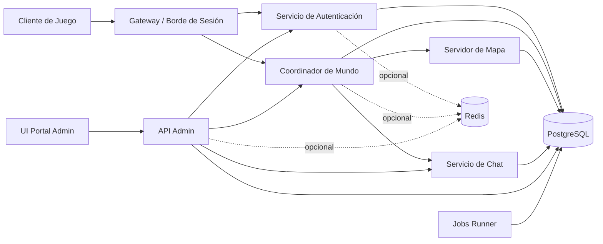
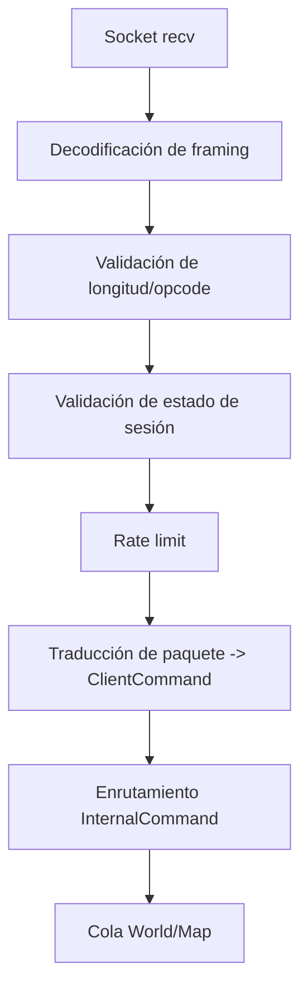
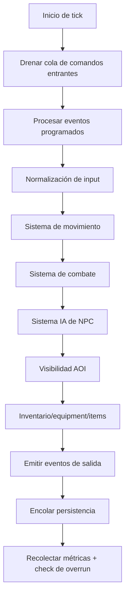
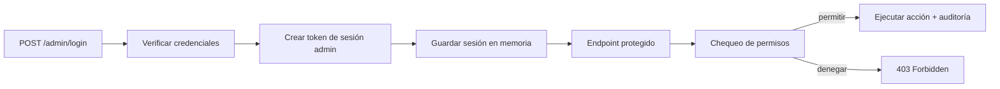

# Diagramas

## Topología de servicios

## Pipeline de paquetes en gateway

## Loop fijo del mapa

## Autenticación admin + RBAC

## Modelo entidad-relacion (PostgreSQL)

```mermaid
erDiagram
  ACCOUNTS {
    uuid id PK
    varchar username UK
    varchar email UK
  }

  SESSIONS {
    uuid id PK
    uuid account_id FK
    uuid character_id FK
    varchar state
    timestamptz expires_at
  }

  MAPS {
    int id PK
    varchar code UK
    varchar name
  }

  MAP_INSTANCES {
    uuid id PK
    int map_id FK
    varchar shard_code
  }

  CHARACTERS {
    uuid id PK
    uuid account_id FK
    int map_id FK
    varchar name UK
  }

  ENTITIES {
    uuid id PK
    uuid map_instance_id FK
    uuid owner_character_id FK
    uuid npc_id
    varchar entity_kind
  }

  NPCS {
    uuid id PK
    varchar code UK
    varchar name
  }

  INVENTORIES {
    uuid id PK
    uuid character_id FK
    bigint gold
  }

  ITEMS {
    bigint id PK
    varchar code UK
    varchar item_type
  }

  INVENTORY_ITEMS {
    uuid id PK
    uuid inventory_id FK
    bigint item_id FK
    int slot
    int quantity
  }

  EQUIPMENT_SLOTS {
    uuid id PK
    uuid character_id FK
    bigint item_id FK
    varchar slot_code
  }

  SKILLS {
    int id PK
    varchar code UK
    varchar display_name
  }

  CHARACTER_SKILLS {
    uuid character_id FK
    int skill_id FK
    smallint level
  }

  COMBAT_LOGS {
    uuid id PK
    uuid map_instance_id FK
    uuid attacker_entity_id
    uuid defender_entity_id
    int skill_id
  }

  GUILDS {
    uuid id PK
    varchar name UK
    uuid created_by
  }

  GUILD_MEMBERS {
    uuid guild_id FK
    uuid character_id FK
    varchar rank
  }

  MAIL_MESSAGES {
    uuid id PK
    uuid from_character_id FK
    uuid to_character_id FK
    varchar subject
  }

  GAME_EVENTS {
    uuid id PK
    uuid actor_character_id FK
    int map_id FK
    varchar event_type
  }

  SANCTIONS {
    uuid id PK
    uuid account_id FK
    uuid character_id FK
    uuid issued_by_admin_id
    varchar sanction_type
    varchar status
  }

  ADMIN_USERS {
    uuid id PK
    varchar email UK
    varchar status
  }

  ADMIN_SESSIONS {
    uuid id PK
    uuid admin_user_id FK
    timestamptz expires_at
  }

  ADMIN_ROLES {
    uuid id PK
    varchar code UK
  }

  ADMIN_PERMISSIONS {
    uuid id PK
    varchar code UK
  }

  ADMIN_USER_ROLES {
    uuid admin_user_id FK
    uuid role_id FK
  }

  ADMIN_ROLE_PERMISSIONS {
    uuid role_id FK
    uuid permission_id FK
  }

  ADMIN_AUDIT_LOGS {
    uuid id PK
    uuid admin_user_id FK
    varchar action_type
    timestamptz created_at
  }

  ACCOUNTS ||--o{ SESSIONS : account_id
  CHARACTERS ||--o{ SESSIONS : character_id
  ACCOUNTS ||--o{ CHARACTERS : account_id
  MAPS ||--o{ CHARACTERS : map_id
  MAPS ||--o{ MAP_INSTANCES : map_id
  MAP_INSTANCES ||--o{ ENTITIES : map_instance_id
  CHARACTERS ||--o{ ENTITIES : owner_character_id

  CHARACTERS ||--o| INVENTORIES : character_id
  INVENTORIES ||--o{ INVENTORY_ITEMS : inventory_id
  ITEMS ||--o{ INVENTORY_ITEMS : item_id
  CHARACTERS ||--o{ EQUIPMENT_SLOTS : character_id
  ITEMS ||--o{ EQUIPMENT_SLOTS : item_id

  CHARACTERS ||--o{ CHARACTER_SKILLS : character_id
  SKILLS ||--o{ CHARACTER_SKILLS : skill_id
  MAP_INSTANCES ||--o{ COMBAT_LOGS : map_instance_id

  GUILDS ||--o{ GUILD_MEMBERS : guild_id
  CHARACTERS ||--o{ GUILD_MEMBERS : character_id
  CHARACTERS ||--o{ MAIL_MESSAGES : from_character_id
  CHARACTERS ||--o{ MAIL_MESSAGES : to_character_id
  CHARACTERS ||--o{ GAME_EVENTS : actor_character_id
  MAPS ||--o{ GAME_EVENTS : map_id
  ACCOUNTS ||--o{ SANCTIONS : account_id
  CHARACTERS ||--o{ SANCTIONS : character_id

  ADMIN_USERS ||--o{ ADMIN_SESSIONS : admin_user_id
  ADMIN_USERS ||--o{ ADMIN_USER_ROLES : admin_user_id
  ADMIN_ROLES ||--o{ ADMIN_USER_ROLES : role_id
  ADMIN_ROLES ||--o{ ADMIN_ROLE_PERMISSIONS : role_id
  ADMIN_PERMISSIONS ||--o{ ADMIN_ROLE_PERMISSIONS : permission_id
  ADMIN_USERS ||--o{ ADMIN_AUDIT_LOGS : admin_user_id
```

Notas:
- `entities.npc_id` referencia logica a `npcs.id` (no FK formal en la migracion base).
- `sanctions.issued_by_admin_id` referencia logica a `admin_users.id` (sin FK formal).
- `combat_logs.skill_id` se conserva como referencia de dominio (sin FK formal).
